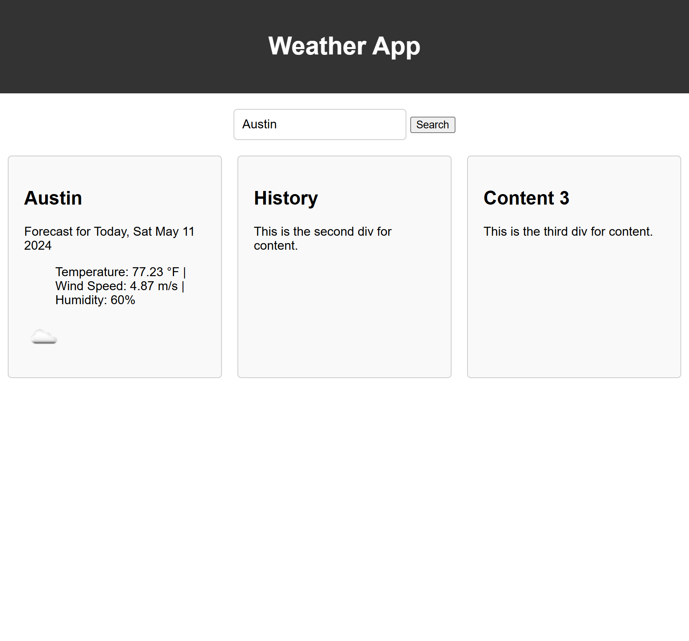

# challenge-5-taskboard
# Description

This is a weather app you can use to pull weather data from the weather API. 

# Usage

You can type in a city and it will pull the temp, wind, and humidity for today. It will also display an icon depicting the weather today. 

https://melivesel.github.io/challenge-6-weather/

# Credits
UT EdX course materials, especially student mini project 6. 
ExPert Learning Assistant
https://api.openweathermap.org
